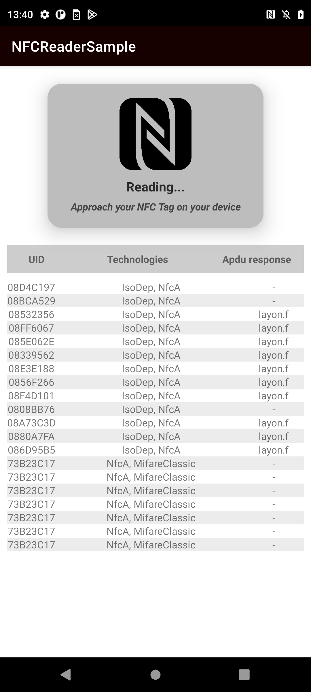

# NFCReaderSample
## Android app sample of how to read an NFC/RFID tag/card informations

* Kotlin
* NFC
* RFID

## How to test?
* Open the app
* Approach your card or tag NFC or RFID (or HCE emulator i.e: https://github.com/layonmartins/RFID-NFC-CardEmulateSample) behind the smartphone
* The NFC Infos will be printed on screen table

## Reference
* https://developer.android.com/guide/topics/connectivity/nfc/nfc
* https://medium.com/the-almanac/how-to-build-a-simple-smart-card-emulator-reader-for-android-7975fae4040f

