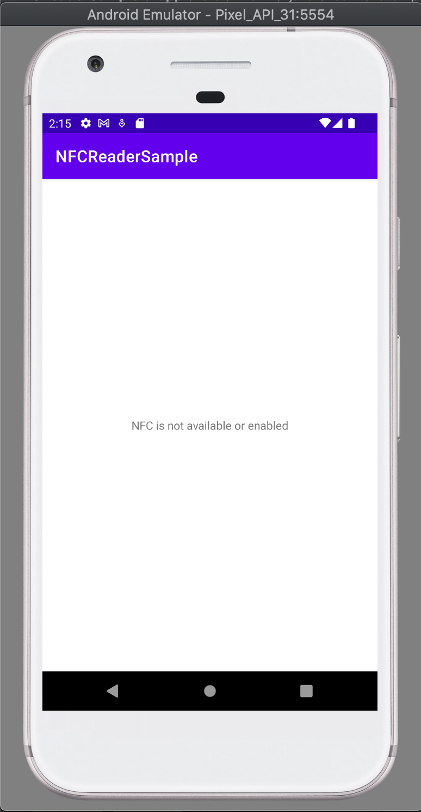

# NFCReaderSample
## Android app sample of how to read an NFC/RFID tag/card informations

* Kotlin
* NFC
* RFID

## How to test?
* Open the app
* Approach your card or tag NFC or RFID behind the smartphone
* The NFC ID will be printed on screen

 

